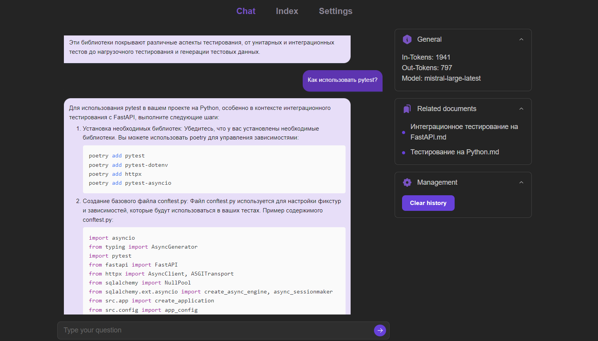
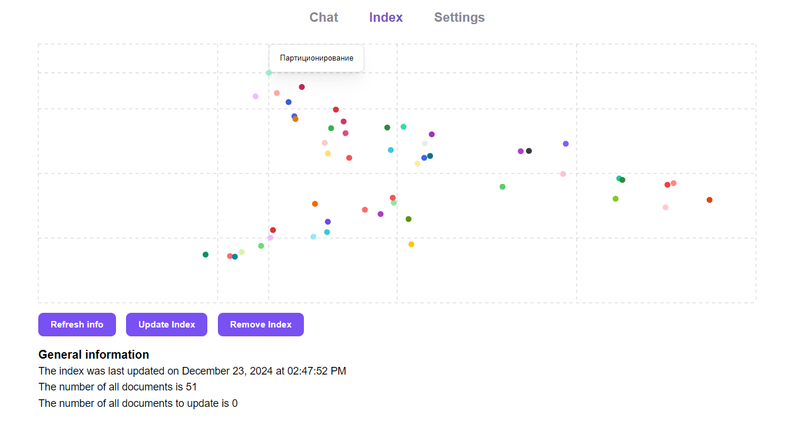

# RAG-On-Obsidian

Ваш интерактивный помощник для работы с заметками Obsidian

RAG-On-Obsidian — это инструмент, который позволяет взаимодействовать со своими заметками в Obsidian с помощью LLM и подхода Retrieval-Augmented Generation (RAG). Приложение предлагает автоматическую индексацию, эффективный поиск и визуализацию данных для глубокого анализа и понимания вашей базы знаний.

## Цели проекта

- Автоматический поиск релевантных запросу документов.
- Генерация ответов на запросы пользователей на основе их заметок.
- Индексация заметок пользователя с учётом изменений.
- Визуализация заметок пользователя в виде облака точек.

## Особенности

- Поддержка автоматической индексации и обновления базы данных при изменении заметок.
- Визуальное представление документов пользователя через PCA-разложение, отображающее взаимосвязи между заметками в виде облака точек.
- Наличие светлой и темной темы приложения.

## Структура проекта

- `backend` — бекенд часть проекта, отвечающая за обработку данных и интеграцию с базой знаний.
- `frontend` — фронтенд часть проекта для взаимодействия пользователя с системой.
- `experiments` — раздел для исследований и экспериментов, связанных с RAG.

## Технологический стек

- **Бекенд**: FastAPI, SQLModel (asyncpg и psycopg), uvicorn
- **RAG**: MistralAI API, aiohttp, pgvector
- **Фронтенд**: TypeScript, Mantine UI, React Query, Vite

## Архитектура приложения

Приложение RAG-On-Obsidian состоит из следующих компонентов:

2. **Web-сервис**:

   - Используется FastAPI на базе uvicorn
   - Обрабатывает пользовательские запросы и взаимодействует с векторной базой данных.
   - Раздает фронтенд и необходимые для него статические файлы

3. **База данных**:

   - Используется PostgreSQL с установленным расширением pgvector
   - Храненит настройки, сообщения в чате и векторные представления заметок
   - Обеспечивает эффективным поиск по векторам с использованием HNSW-алгоритма

Все компоненты развёртываются в виде Docker-контейнеров, оркестрация осуществляется с помощью Docker Compose.

## Интерфейс

Интерфейс состоит из трех основных вкладок: `Chat`, `Index` и `Settings`. Рассмотрим подробее каждую из них.

### Chat

Во вкладке `Chat` происходит основное взаимодействие пользователя с приложением. Через окно чата пользователь может отправлять интересующие вопросы по документам к RAG системе и получать на них ответ от выбранной в настройках языковой модели.

<div align="center">
  
</div>

### Index

Вкладка `Index` содержит визуализацию индекса базы данных, а также возможность этот индекс обновить, удалить и получить актуальную информацию по текущему индексу. 

<div align="center">
  
</div>

### Settings

Здесь, пользователь может выбрать темную или светлую тему для приложении, а также задать настройки для используемой генеративной модели.

<div align="center">
  
</div>

<div align="center">
  
</div>

## Бекенд

### Обработка запросов

При получении пользовательского запроса:
- Генерируем эмбеддинг запроса с помощью модели Mistral-Embed
- Ищем topK релевантных чанков для данного запроса
- На основе пользовательского запроса и чанков с помощью LLM (сейчас интеграция с MistralAI) генерируем итоговый ответ

<div align="center">
  
</div>

### Индексация базы данных

При запросе пользователя на обновление индекса:
- Получаем список файлов, которые изменились
- Генерируем по этим файлам новые эмбеддинги по измененным файлам
- По всем эмбеддингам в базе данных считаем PCA разложение, чтобы получить первые две компоненты векторов
- По полученному результату обновляем наш индекс

<div align="center">
  
</div>

## Исследования

Подробнее про сплиттинг текста, выбор эмбединговой модели и оценивание качества ретрива можно почитать [здесь](https://github.com/Daniil-Solo/RAG-On-Obsidian/blob/main/experiments/README.md).

## Запуск приложения

### Docker (рекомендуемый вариант)
0. Убедитесь, что он установлен и запущен на машине командой `docker -v`
1. Скачиваем файл [docker-compose.yml](https://raw.githubusercontent.com/Daniil-Solo/RAG-On-Obsidian/refs/heads/main/docker-compose.yml)
2. Указываем в web.volumes вместо `./backend/obsidian` абсолютный путь до директории с заметками Obsidian
3. Выполняем в директории с файлом команду `docker-compose up -d` или `docker compose up -d`
4. Переходим на http://localhost/ в браузере
5. Вы великолепны!

### Без Docker

- Если у вас Linux/MacOS, то рассмотрите вариант с установкой Docker, а потом вернитесь к запуску из Docker
- Если у вас Windows, то рассмотрите вариант с установкой WSL и поверх него Docker, а потом вернитесь к запуску из Docker

Если предыдущие два варианта не подходят, то поехали запускать без Docker:
1. Устанавливаем PostgreSQL, создаем базу данных, не забываем пароль
2. Устанавливаем расширение pgvector в этой базе данных командой: `CREATE EXTENSION IF NOT EXISTS vector;`
3. Скачиваем репозиторий командой: `git clone https://github.com/Daniil-Solo/RAG-On-Obsidian.git`
4. Создаем виртуальное окружение в директории backend и устанавливаем зависимости: `pip install poetry && poetry install`
5. Скачиваем папку с билдом фронта в директорию backend [папку с Google-диска](https://drive.google.com/drive/folders/13eJsjdyAk7QsPuFDU_Jwq0nZNWYhmWoo?usp=sharing)
6. Создаем в директори backend файл .env и заполняем его:
```env
MODE=production
OBSIDIAN_PATH=<YOUR-ABSOLUTE-PATH-TO-OBSIDIAN-NOTES-DIRECTORY>
STATIC_PATH=<YOUR-ABSOLUTE-PATH-TO-FRONT-BUIKD-DIRECTORY>
DB_HOST=<YOUR-DATABASE-HOST> # default is localhost
DB_PORT=<YOUR-DATABASE-PORT> # default is 5432
DB_USER=<YOUR-USER-NAME-IN-POSTGRES> # default is postgres
DB_PASSWORD=<YOUR-PASSWORD-IN-POSTGRES>
DB_NAME=<YOUR-DATABASE-NAME-IN-POSTGRES> # default is postgres
```
7. Из директории backend запускаем командой: `poetry run uvicorn src.app:app --port 5000`
8. Переходим на http://localhost/ в браузере
9. Вы восхитительны!

## Команда

Проектом занимались:

- [Даниил](https://t.me/daniilsolovjev)
- [Ильгиз](https://t.me/abdullinilr)
- [Максим](https://t.me/AetelFinch)

