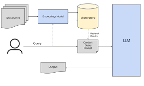
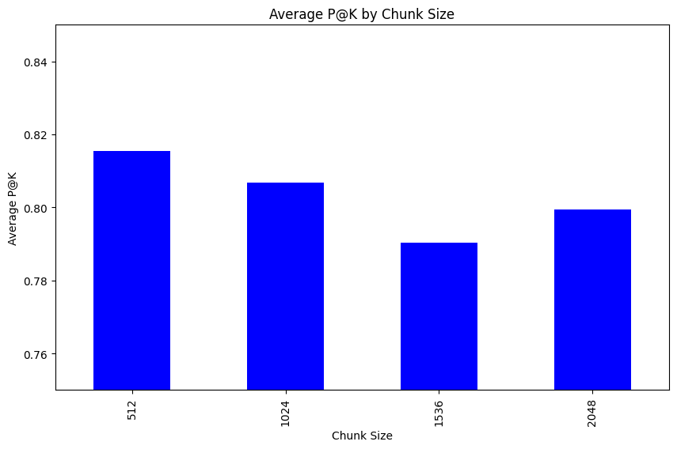
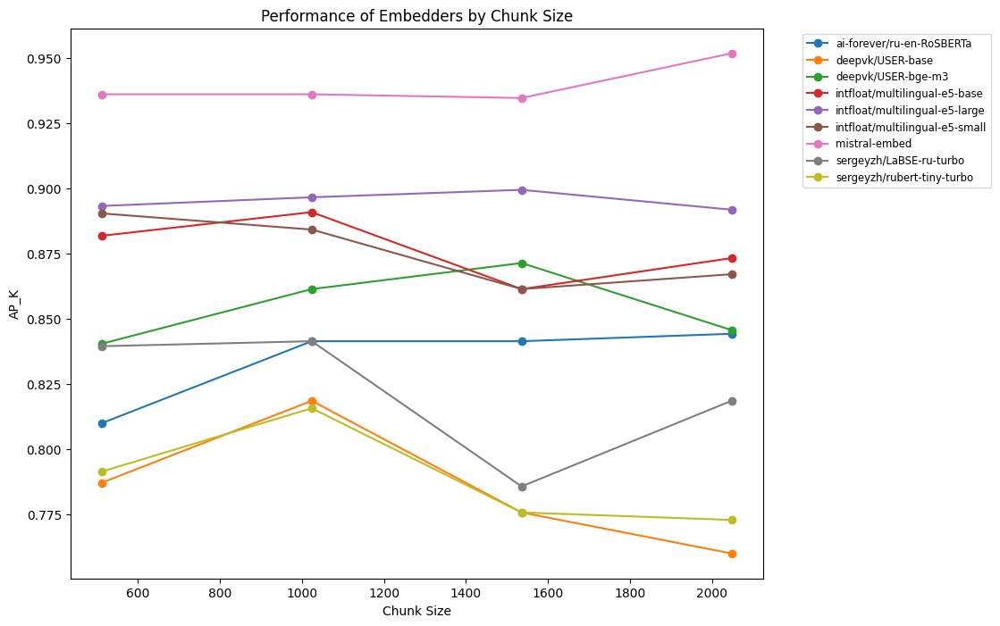

## Эксперименты
### Использование готовых фреймворков

Сначала было принято решение построить весь RAG пайплайн с использованием существующих фреймворков. Однако после того как команда протестировала библиотеку `llama_index`, мы решили реализовать решение с нуля по нескольким причинам:

- Использование `llama_index` сводилось бы к необходимости простого изучения документации, чтобы понять, какие строки кода реализуют нужную функциональность.
- Написание собственного кода с нуля предоставляет гораздо больше возможностей для обучения и исследования.
- Создание собственной базы кода дает гибкость в реализации нестандартных методов для RAG при необходимости.

### Используемые технологии

Для разбиения текста на части мы использовали `langchain CharacterTextSplitter`. Формат .md имеет четко выраженную структуру, что позволяет эффективно применять рекурсивное разбиение текста. На первом этапе мы используем регулярные выражения, чтобы разделить текст по заголовкам, отмеченным знаком `#`. Затем, если полученный кусок текста превышает заданную длину, применяем разбиение по двум переносам строки (`\n\n`), которые в формате .md обозначают начало нового параграфа. Если длина параграфа также слишком велика, разделяем его по одиночным переносам строк (`\n`).

Хотя можно было бы добавить еще одно разбиение по пробелам, наше тестирование показало, что это не приносит значительного улучшения качества.

В качестве векторной базы данных мы выбрали `qdrant`. Эта база данных зарекомендовала себя в сообществе разработчиков, предоставляет удобный Python API и идеально подходит для хранения векторов и текстовых метаданных.

Для работы с эмбеддерами мы использовали библиотеку `sentence_transformers`, которая предоставляет удобный интерфейс для использования различных эмбеддеров.

### Архитектура

Мы реализовали стандартную архитектуру для RAG-приложений:

### Валидация и тестирование
#### Метрика

Для оценки качества поиска в нашем RAG пайплайне использовалась метрика **Average Precision at K (AP@K)**. Она показывает, насколько хорошо векторная база данных находит релевантные документы среди первых `K` результатов.

**Формула метрики**:

$\text{Precision@K}$ = $\frac{\text{Количество релевантных документов в топ-K}}{\min(\text{Общее количество релевантных документов}, K)}$

$$
\text{AP@K} = \frac{1}{K} \sum_{i=1}^{K} \text{Precision@i}
$$
Где:
- $K$ — число топ документов, которые оцениваются.
- $\text{Precision@i}$ — точность на уровне $i$ , то есть доля релевантных документов среди первых $i$результатов.
- $\text{AP@K}$ усредняет значения $\text{Precision@i}$ для всех $i$ от 1 до $K$.

**Алгоритм вычисления**:

1. Извлечь первые $K$ документов из результатов поиска.
2. Для каждого документа проверить, содержится ли он в списке релевантных документов.
3. Рассчитать точность $\text{Precision@i}$ на каждой позиции от 1 до $K$.
4. Усреднить все значения $\text{Precision@i}$, чтобы получить $\text{AP@K}$.

#### Варьируемые параметры 
Для оценки качества нашей архитектуры мы варьировали следующие параметры:

- модель для создания векторных представлений текста
- размер чанков текста
- метрику для измерения схожести векторов

На данный момент наиболее распространенной метрикой для оценки близости векторов в NLP является `cosine_distance`. Мы также тестировали метрику MSE, но выяснилось, что для нормализованных векторных представлений результат MSE и `cosine_distance` почти не отличается.

Для выбора моделей эмбеддеров мы использовали [MTEB](https://huggingface.co/spaces/mteb/leaderboard), с полным списком результатов, который приведен в таблице.

Так как большинство выбранных моделей поддерживает ограничение в 512 токенов на один эмбеддинг, мы ограничили длину текста в 2048 символов (что соответствует примерно 512 токенам для русского языка). Минимальный размер чанка был установлен на 512 символов, так как при меньших размерах мы теряли слишком много контекста.

Размеры чанков для тестирования были выбраны следующие:
- 512
- 1024
- 1536
- 2048

Также мы решили протестировать `MistralAPI` в качестве эмбеддера. 

#### Результат
Результаты представлены в таблице ниже:

<table border="1" class="dataframe">
  <thead>
    <tr style="text-align: right;">
      <th></th>
      <th>AP@K</th>
      <th>embedder_name</th>
      <th>chunk_size</th>
    </tr>
  </thead>
  <tbody>
    <tr>
      <th>43</th>
      <td>0.951905</td>
      <td>mistral-embed</td>
      <td>2048</td>
    </tr>
    <tr>
      <th>41</th>
      <td>0.936190</td>
      <td>mistral-embed</td>
      <td>1024</td>
    </tr>
    <tr>
      <th>40</th>
      <td>0.936190</td>
      <td>mistral-embed</td>
      <td>512</td>
    </tr>
    <tr>
      <th>42</th>
      <td>0.934762</td>
      <td>mistral-embed</td>
      <td>1536</td>
    </tr>
    <tr>
      <th>2</th>
      <td>0.899524</td>
      <td>intfloat/multilingual-e5-large</td>
      <td>1536</td>
    </tr>
    <tr>
      <th>1</th>
      <td>0.896667</td>
      <td>intfloat/multilingual-e5-large</td>
      <td>1024</td>
    </tr>
    <tr>
      <th>0</th>
      <td>0.893333</td>
      <td>intfloat/multilingual-e5-large</td>
      <td>512</td>
    </tr>
    <tr>
      <th>3</th>
      <td>0.891905</td>
      <td>intfloat/multilingual-e5-large</td>
      <td>2048</td>
    </tr>
    <tr>
      <th>5</th>
      <td>0.890952</td>
      <td>intfloat/multilingual-e5-base</td>
      <td>1024</td>
    </tr>
    <tr>
      <th>8</th>
      <td>0.890476</td>
      <td>intfloat/multilingual-e5-small</td>
      <td>512</td>
    </tr>
    <tr>
      <th>9</th>
      <td>0.884286</td>
      <td>intfloat/multilingual-e5-small</td>
      <td>1024</td>
    </tr>
    <tr>
      <th>4</th>
      <td>0.881905</td>
      <td>intfloat/multilingual-e5-base</td>
      <td>512</td>
    </tr>
    <tr>
      <th>7</th>
      <td>0.873333</td>
      <td>intfloat/multilingual-e5-base</td>
      <td>2048</td>
    </tr>
    <tr>
      <th>26</th>
      <td>0.871429</td>
      <td>deepvk/USER-bge-m3</td>
      <td>1536</td>
    </tr>
    <tr>
      <th>11</th>
      <td>0.867143</td>
      <td>intfloat/multilingual-e5-small</td>
      <td>2048</td>
    </tr>
    <tr>
      <th>6</th>
      <td>0.861429</td>
      <td>intfloat/multilingual-e5-base</td>
      <td>1536</td>
    </tr>
    <tr>
      <th>25</th>
      <td>0.861429</td>
      <td>deepvk/USER-bge-m3</td>
      <td>1024</td>
    </tr>
    <tr>
      <th>10</th>
      <td>0.861429</td>
      <td>intfloat/multilingual-e5-small</td>
      <td>1536</td>
    </tr>
    <tr>
      <th>27</th>
      <td>0.845714</td>
      <td>deepvk/USER-bge-m3</td>
      <td>2048</td>
    </tr>
    <tr>
      <th>15</th>
      <td>0.844286</td>
      <td>ai-forever/ru-en-RoSBERTa</td>
      <td>2048</td>
    </tr>
    <tr>
      <th>13</th>
      <td>0.841429</td>
      <td>ai-forever/ru-en-RoSBERTa</td>
      <td>1024</td>
    </tr>
    <tr>
      <th>14</th>
      <td>0.841429</td>
      <td>ai-forever/ru-en-RoSBERTa</td>
      <td>1536</td>
    </tr>
    <tr>
      <th>33</th>
      <td>0.841429</td>
      <td>sergeyzh/LaBSE-ru-turbo</td>
      <td>1024</td>
    </tr>
    <tr>
      <th>24</th>
      <td>0.840476</td>
      <td>deepvk/USER-bge-m3</td>
      <td>512</td>
    </tr>
    <tr>
      <th>32</th>
      <td>0.839524</td>
      <td>sergeyzh/LaBSE-ru-turbo</td>
      <td>512</td>
    </tr>
    <tr>
      <th>35</th>
      <td>0.818571</td>
      <td>sergeyzh/LaBSE-ru-turbo</td>
      <td>2048</td>
    </tr>
    <tr>
      <th>29</th>
      <td>0.818571</td>
      <td>deepvk/USER-base</td>
      <td>1024</td>
    </tr>
    <tr>
      <th>17</th>
      <td>0.815714</td>
      <td>sergeyzh/rubert-tiny-turbo</td>
      <td>1024</td>
    </tr>
    <tr>
      <th>12</th>
      <td>0.810000</td>
      <td>ai-forever/ru-en-RoSBERTa</td>
      <td>512</td>
    </tr>
    <tr>
      <th>16</th>
      <td>0.791429</td>
      <td>sergeyzh/rubert-tiny-turbo</td>
      <td>512</td>
    </tr>
    <tr>
      <th>28</th>
      <td>0.787143</td>
      <td>deepvk/USER-base</td>
      <td>512</td>
    </tr>
    <tr>
      <th>34</th>
      <td>0.785714</td>
      <td>sergeyzh/LaBSE-ru-turbo</td>
      <td>1536</td>
    </tr>
    <tr>
      <th>30</th>
      <td>0.775714</td>
      <td>deepvk/USER-base</td>
      <td>1536</td>
    </tr>
    <tr>
      <th>18</th>
      <td>0.775714</td>
      <td>sergeyzh/rubert-tiny-turbo</td>
      <td>1536</td>
    </tr>
    <tr>
      <th>19</th>
      <td>0.772857</td>
      <td>sergeyzh/rubert-tiny-turbo</td>
      <td>2048</td>
    </tr>
    <tr>
      <th>31</th>
      <td>0.760000</td>
      <td>deepvk/USER-base</td>
      <td>2048</td>
    </tr>
    <tr>
      <th>36</th>
      <td>0.715714</td>
      <td>cointegrated/LaBSE-en-ru</td>
      <td>512</td>
    </tr>
    <tr>
      <th>39</th>
      <td>0.708571</td>
      <td>cointegrated/LaBSE-en-ru</td>
      <td>2048</td>
    </tr>
    <tr>
      <th>37</th>
      <td>0.705714</td>
      <td>cointegrated/LaBSE-en-ru</td>
      <td>1024</td>
    </tr>
    <tr>
      <th>38</th>
      <td>0.674286</td>
      <td>cointegrated/LaBSE-en-ru</td>
      <td>1536</td>
    </tr>
    <tr>
      <th>20</th>
      <td>0.582857</td>
      <td>cointegrated/rubert-tiny2</td>
      <td>512</td>
    </tr>
    <tr>
      <th>23</th>
      <td>0.458571</td>
      <td>cointegrated/rubert-tiny2</td>
      <td>2048</td>
    </tr>
    <tr>
      <th>22</th>
      <td>0.412857</td>
      <td>cointegrated/rubert-tiny2</td>
      <td>1536</td>
    </tr>
    <tr>
      <th>21</th>
      <td>0.381429</td>
      <td>cointegrated/rubert-tiny2</td>
      <td>1024</td>
    </tr>
  </tbody>
</table>

Как видно, наилучшие результаты показал `MistralAPI`.

### Анализ результатов

#### Влияние размера чанков на качество

На графиках ниже показано, как влияет размер чанков на качество:

Из графиков видно, что размер чанков оказывает некоторое влияние на качество, но оно не является критическим. В целом, результаты остаются достаточно стабильными.

#### Влияние эмбеддеров на качество

График ниже демонстрирует результаты для разных эмбеддеров (исключая наихудшие модели, такие как `cointegrated/LaBSE-en-ru` и `cointegrated/rubert-tiny2`):

Из графиков видно, что эмбеддеры с хорошими результатами показывают незначительные колебания качества в зависимости от размера чанков. В частности, для чанков размером 1024 мы наблюдаем небольшое улучшение, в то время как для чанков размером 1536 качество слегка снижается.
